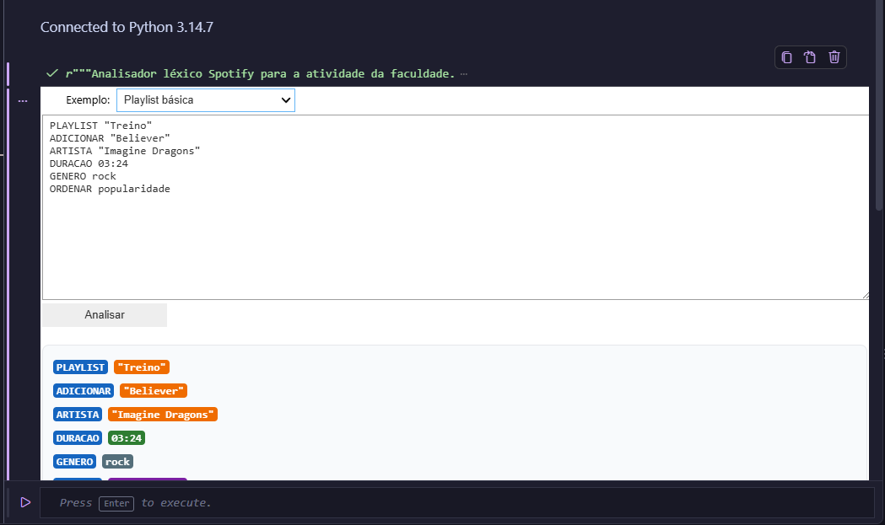
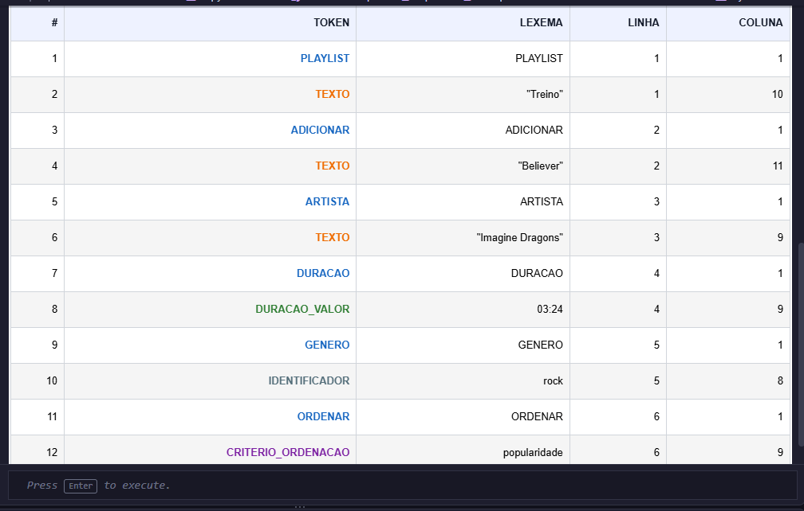
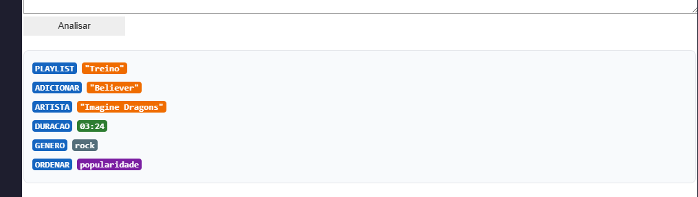
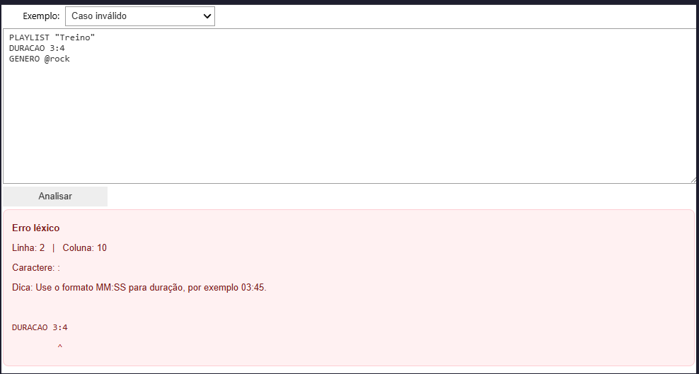

# Spotify Lexer FMU

Projeto desenvolvido para a atividade de compiladores da FMU sobre análise léxica com Python e Lark.

## Integrantes

- Bruno Dos Reis Ferreira Santos — RA: 2564952
- Vinicius de Freitas Ferreira — RA: 2373516
- Matheus Francisco — RA: 2693112
- Matheus de Oliveira — RA: 2369955

## Descrição do projeto

Este projeto implementa um analisador léxico para uma mini-linguagem de comandos de playlist Spotify.
A solução utiliza:

- Python
- Lark
- ipywidgets
- Jupyter / VS Code

A linguagem reconhece comandos como:

```text
PLAYLIST "Treino"
ADICIONAR "Believer"
ARTISTA "Imagine Dragons"
DURACAO 03:24
GENERO rock
ORDENAR popularidade
```

Além disso, o projeto inclui:

- tabela de tokens
- destaque visual dos tokens
- tratamento de erros léxicos com linha e coluna
- casos válidos e inválidos
- conflito de prioridade documentado
- interface interativa com dropdown, entrada e botão de análise

## Como baixar o projeto

1. Acesse o repositório no GitHub.
2. Clique em "Code".
3. Escolha a opção "Download ZIP" ou clone com Git:

```bash
git clone https://github.com/BrunoReiis/Spotify-lexer-fmu.git
```

## Como abrir no VS Code

1. Abra o VS Code.
2. Clique em "File" → "Open Folder".
3. Selecione a pasta do projeto baixado.

## Como executar

### Opção 1: executar a interface interativa

Abra o terminal integrado do VS Code e execute:

```powershell
cd "caminho\para\a-pasta-do-projeto"
.
.\.venv\Scripts\Activate.ps1
python .\spotify_lexer.py
```

Obs.: se o VS Code não mostrar a interface, o ideal é abrir o arquivo em um notebook Jupyter ou usar o ambiente interativo do VS Code.

### Opção 2: testar os casos do lexer

```powershell
cd "caminho\para\a-pasta-do-projeto"
.
.\.venv\Scripts\Activate.ps1
python .\test_spotify_lexer.py
```

Se tudo estiver correto, a saída será:

```text
testes ok
```

## Como usar a interface

1. Seleciona um exemplo no dropdown.
2. Edite o texto de entrada.
3. Clique em "Analisar".
4. Veja:
   - tabela de tokens
   - texto colorido
   - mensagens de erro, se houver

## Capturas de tela

Abaixo estão alguns exemplos de execução do projeto em ambiente de desenvolvimento:

### 1. Entrada válida da playlist


### 2. Tokens reconhecidos pela linguagem


### 3. Interface interativa com dropdown e análise


### 4. Caso com erro léxico e mensagem amigável


## Observações

Este projeto foi desenvolvido como atividade acadêmica de análise léxica e não implementa parser completo, apenas a fase léxica da linguagem.

## Licença

Projeto acadêmico para fins educacionais.
